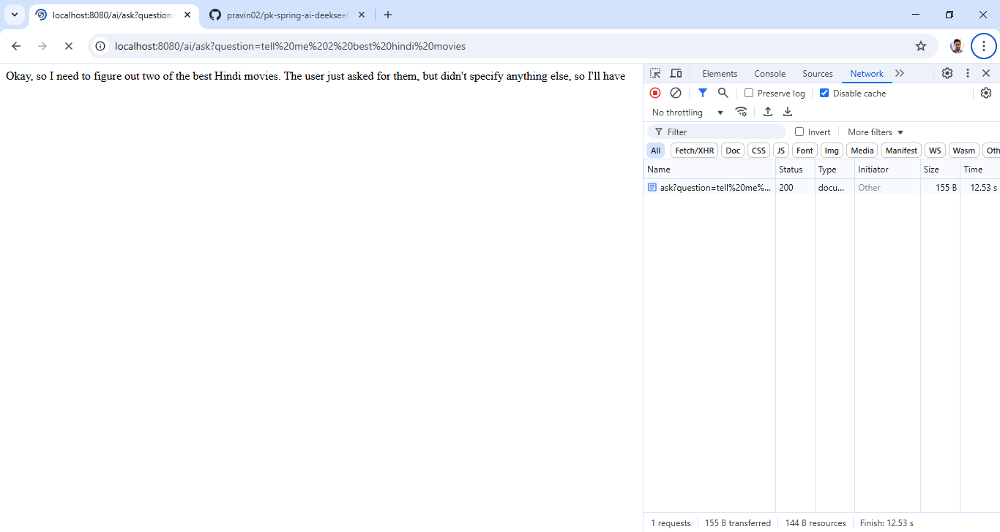

## This is basic integration of spring boot AI module with deepseek r1:1.5b model

### Run this application and execute below curl or open browser and execute the below url.
http://localhost:8080/ai/ask?question=tell%20me%202%20best%20hindi%20movies

curl 'http://localhost:8080/ai/ask?question=tell%20me%202%20best%20hindi%20movies' \
-H 'Accept: text/html,application/xhtml+xml,application/xml;q=0.9,image/avif,image/webp,image/apng,*/*;q=0.8,application/signed-exchange;v=b3;q=0.7' \
-H 'Accept-Language: en-US,en;q=0.9' \
-H 'Cache-Control: no-cache' \
-H 'Connection: keep-alive' \
-H 'Pragma: no-cache' \
-H 'Sec-Fetch-Dest: document' \
-H 'Sec-Fetch-Mode: navigate' \
-H 'Sec-Fetch-Site: none' \
-H 'Sec-Fetch-User: ?1' \
-H 'Upgrade-Insecure-Requests: 1' \
-H 'User-Agent: Mozilla/5.0 (Windows NT 10.0; Win64; x64) AppleWebKit/537.36 (KHTML, like Gecko) Chrome/132.0.0.0 Safari/537.36' \
-H 'sec-ch-ua: "Not A(Brand";v="8", "Chromium";v="132", "Google Chrome";v="132"' \
-H 'sec-ch-ua-mobile: ?0' \
-H 'sec-ch-ua-platform: "Windows"'

